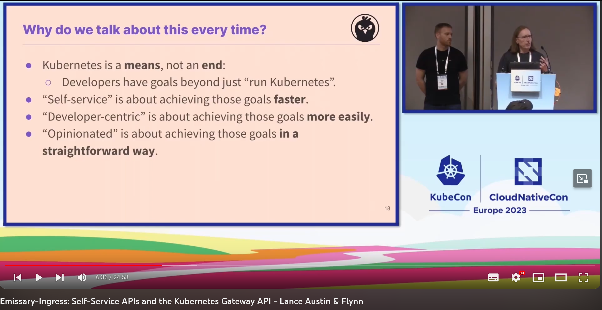
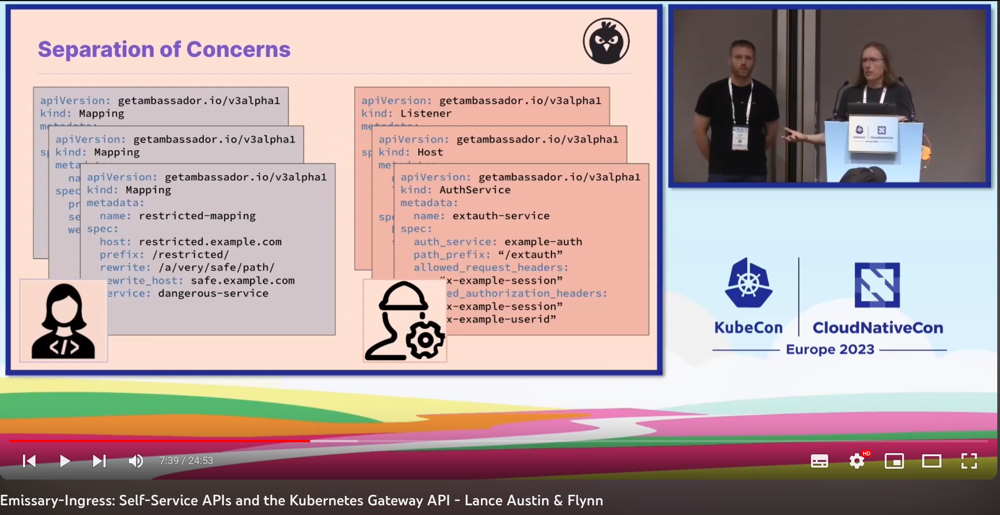
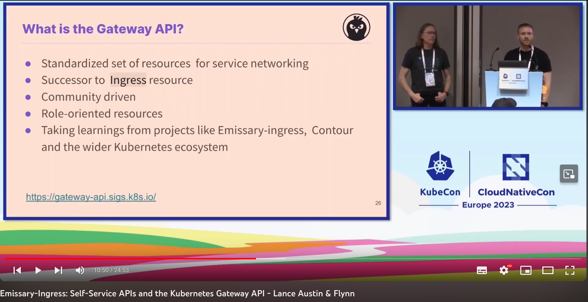
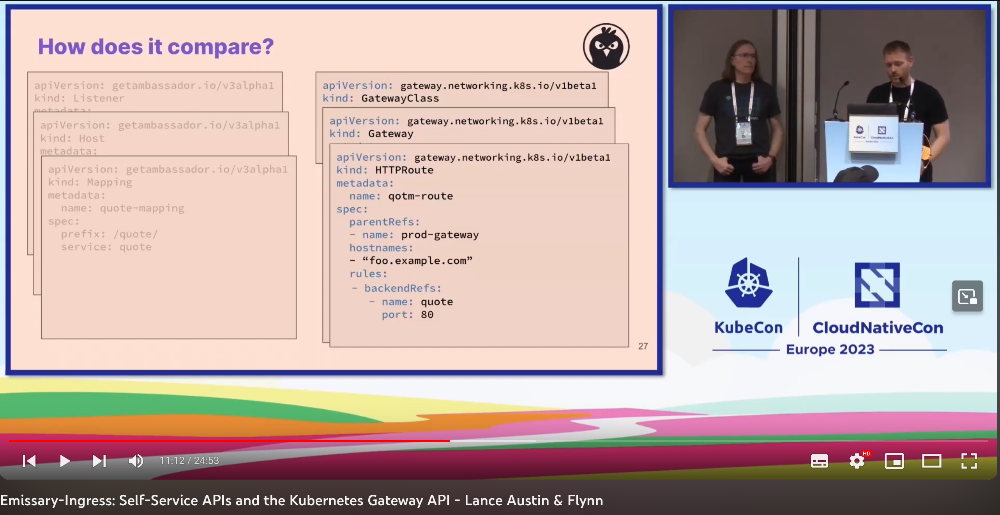
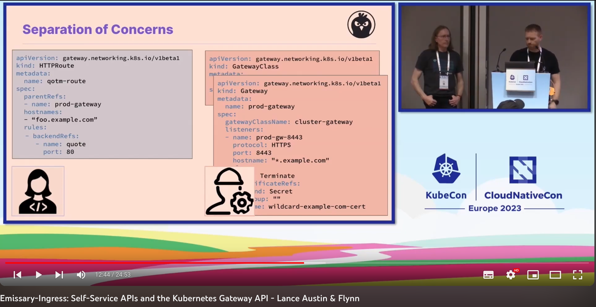

# kubecon-eu2023
Just some notes about the KubeCon 2023 in Europe

I hadn't been able to attend to [KubeCon 2023 in Amsterdam this year](https://events.linuxfoundation.org/archive/2023/kubecon-cloudnativecon-europe/), so I came back later to have a look at some of the nice talks available on YT here: https://www.youtube.com/playlist?list=PLj6h78yzYM2PyrvCoOii4rAopBswfz1p7 Here are my notes about what I found interesting.

# Emissary-Ingress: An alternative to Traefik and Big Meshes?

https://www.youtube.com/watch?v=piDYmZObh_M&list=PLj6h78yzYM2PyrvCoOii4rAopBswfz1p7&index=36&pp=iAQB

They claim to develop an "Self-service, developer-centric & opinionated ingress gateway":

With Emissary you have the chance to use a well-known `Ingress` CRD, but this might not scale so good when multiple people start to alter the same resource. Here the separate CRDs like `Listener`, `Host`, `Mapping`, `AuthService` come into play:

Emissary focusses on the Gateway API, which is the successor to the `Ingress` resource`:

But Emissary does not support new Gateway API fully right now.